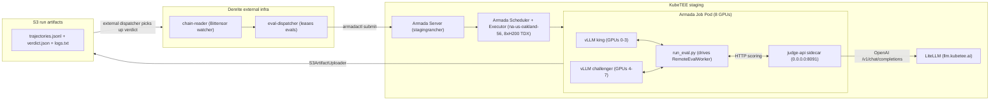

# SN97 Denrite (Albedo) — KubeTEE Evaluation PoC

## High-level shape

`Denrite's external eval-dispatcher` submits **one Armada Job per miner model
evaluation**. KubeTEE's Armada (control-plane on `stagingrancher`, executor on
`na-us-oakland-56`) schedules the pod onto an 8-GPU node. The pod runs **one
king-of-the-hill evaluation** — Albedo's `RemoteEvalWorker` spins up two vLLM
tensor-parallel instances (previous king on GPUs 0-3, challenger on GPUs 4-7),
samples SWE-ZERO trajectories, judges the outputs through
`https://llm.kubetee.ai` (our LiteLLM gateway), uploads run artifacts
(trajectories + verdict JSON + logs) to S3 via Albedo's native
`S3ArtifactUploader`, and exits. Denrite's external pipeline polls the S3
bucket for the verdict and continues its normal chain flow.

No Denrite docker-compose, no Postgres-backed queue, no Bittensor chain reads
inside KubeTEE — the only dynamic inputs per job are the king and challenger
model refs + the S3 bucket the dispatcher wants artifacts written to.
Everything else (judge URL, judge models, sample count, GPU split, image,
cluster placement) is baked into KubeTEE-side config.



## Prerequisites (from Denrite, before the first job)

1. **King + challenger model refs** for the first run — public HF repo refs,
   Hippius URLs, or S3 keys. The PoC bypasses Bittensor chain resolution, so
   we need explicit URIs.
2. **Where run artifacts should land** — Denrite's `albedo-artifacts` bucket
   on Hippius (recommended; reuse their existing flow) OR a dedicated KubeTEE
   bucket on our Cloudflare R2. Either works because the uploader is generic
   S3-API-compatible.
3. **Submission path** — for the PoC, an SSH tunnel from Denrite's dispatcher
   into `stagingrancher` (port 50051). A durable `armada-api.kubetee.ai`
   IngressRoute is the follow-up (out of PoC scope).
4. **Secrets** — a LiteLLM virtual key on `llm.kubetee.ai` for the judge; an HF
   token if the model repos are private; S3 creds for the artifact bucket. All
   applied out-of-band per `fleet-gitops/infrastructure/SECRET-MANAGEMENT-STRATEGY.md`.

## Files in this directory

| File | Purpose |
|------|---------|
| `app/run_eval.py` | Per-job self-drive entrypoint. Builds an `EvalRequest` from env, wires `RemoteSettings` toward the in-pod judge-api sidecar, runs upstream `RemoteEvalWorker.execute()`, prints the verdict JSON to stdout. |
| `Dockerfile` | PoC image — `nvcr.io/nvidia/vllm:latest` base + albedo's non-vLLM deps + the PoC entrypoint. |
| `deploy/pod-template.yaml` | K8s pod spec (two containers: `eval` + `judge-api` sidecar) embedded in Armada's JobSubmitRequest. |
| `deploy/armada-job-template.yaml` | Armada JobSubmitRequest template — Denrite's dispatcher fills in the four per-job fields and submits. |
| `deploy/configmap-poc-env.yaml` | Non-secret env (judge URL, judge model IDs, sample count, GPU split, S3 layout). Applied out-of-band on `na-us-oakland-56-direct`. |
| `deploy/secret-template.yaml` | Template for the out-of-band Secret (LiteLLM virtual key, HF token, S3 creds). |

## Per-job inputs (set by Denrite's dispatcher per submission)

| Env var | Meaning |
|---------|---------|
| `KING_MODEL_URI` | URI of the previous king model (HF repo, S3 path, Hippius ref, or local path). |
| `KING_MODEL_HASH` | sha256 of the king model artifact. |
| `CHALLENGER_MODEL_URI` | URI of the challenger model being evaluated. |
| `CHALLENGER_MODEL_HASH` | sha256 of the challenger model artifact. |
| `EVAL_RUN_ID` | Stable UUID for this evaluation — used in the S3 artifact path and the verdict JSON. |
| `SUBMISSION_ID` | Stable UUID for the submission — same inclusion in the verdict and artifacts. |
| `KING_VERSION` | Optional integer king version (defaults to 0). |

Everything else has a KubeTEE-side default in the ConfigMap.

## Submission path (PoC)

The Armada Server on `stagingrancher` has `anonymousAuth: true` and **no
external ingress** today. For the PoC, Denrite's dispatcher reaches it via an
SSH tunnel (same pattern as `na-us-oakland-56-direct`):

```bash
# On Denrite's dispatcher host, once:
ssh -fN -L 50051:armada.armada.svc.cluster.local:50051 <stagingrancher-jump-host>

# Then submit:
armadactl submit kubetee/deploy/armada-job-template.yaml \
  --armadaUrl localhost:50051
```

**Follow-up (deferred)**: expose the Armada Submit API on
`armada-api.kubetee.ai` with a Traefik `IngressRoute` + TLS + a tight
whitelist, same shape as the LLM gateway.

## Judge → llm.kubetee.ai routing

Confirmed via `src/albedo_eval_service/judge_config.py` reads:

- `ALBEDO_JUDGE_OPENROUTER_BASE_URL` → `https://llm.kubetee.ai/v1`
- `ALBEDO_JUDGE_OPENROUTER_API_KEY` → LiteLLM virtual key (Secret)
- `ALBEDO_JUDGE_EVALUATOR_MODEL` → `z-ai/glm-5.2` (upstream default; already served)
- `ALBEDO_JUDGE_SOTA_MODELS` → `z-ai/glm-5.2,moonshotai/kimi-k3,deepseek/deepseek-v4-pro`

The LiteLLM gateway serves the same OpenAI-compatible `/v1/chat/completions`
endpoint that albedo's `OpenRouterJudgeClient` expects, so this is a pure env
override — no code change to albedo.

The upstream-hard-coded `JUDGE_MODELS` in `judge_core.py`
(`("z-ai/glm-5.2", "qwen/qwen3.5-397b-a17b", "deepseek/deepseek-v3.2")`) is
only read by albedo's `/score-batch` endpoint when determining the judge
panel. The current PoC scoring flow chooses the judge panel from the SOTA
pool, so the hard-coded `JUDGE_MODELS` doesn't bite — zero changes to the
LiteLLM model catalog are needed for the PoC.

## Run the PoC

1. **Build + push the image** (from the albedo repo root, on the `kubetee-poc`
   branch):
   ```bash
   docker buildx build --platform linux/amd64 \
     -f kubetee/Dockerfile \
     -t ghcr.io/kubetee-ai/albedo-poc:latest --push .
   ```

2. **Apply the ConfigMap** (out-of-band, not Fleet-managed):
   ```bash
   kubectl --context na-us-oakland-56-direct apply -f kubetee/deploy/configmap-poc-env.yaml
   ```

3. **Apply the Secret** (out-of-band, never committed):
   ```bash
   # Fill in the template locally (outside the repo):
   cp kubetee/deploy/secret-template.yaml ~/kubetee-secret-backends/albedo-poc-secrets.yaml
   $EDITOR ~/kubetee-secret-backends/albedo-poc-secrets.yaml
   kubectl --context na-us-oakland-56-direct apply -f ~/kubetee-secret-backends/albedo-poc-secrets.yaml
   ```

4. **First PoC run** — submit from KubeTEE side (we drive, Denrite observes):
   ```bash
   armadactl submit kubetee/deploy/armada-job-template.yaml \
     --armadaUrl armada.armada.svc.cluster.local:50051
   ```
   Watch the pod land on `na-us-oakland-56`:
   ```bash
   kubectl --context na-us-oakland-56-direct -n albedo-poc get pods -l app.kubernetes.io/name=albedo-poc
   kubectl --context na-us-oakland-56-direct -n albedo-poc logs -f <pod-name> -c eval
   ```
   Expected log sequence:
   - `model_download_progress ref=<king>` then `<challenger>` complete
   - vLLM `Uvicorn running` for both splits
   - judge traffic to `llm.kubetee.ai`
   - final verdict JSON with `score_king`, `score_challenger`, `challenger_won`
   - `S3ArtifactUploader` log lines confirming upload to the bucket

5. **Second PoC run** — submit from Denrite infra via the SSH-tunneled
   `localhost:50051`, with `jobSetId = miner-<hotkey>-block-<n>` and the
   per-job env filled in. Verify the run shows up in Armada and artifacts land
   in the bucket they own.

## Safety notes

- **Never force-delete** the eval pod: `kubectl delete pod --force` is
  forbidden on any pod that may hold TDX/vfio state. Use `kubectl delete pod`
  (graceful) or `armadactl cancel` and wait. The PoC runs with
  `runtimeClassName: nvidia` so no CC risk, but the advice holds for later
  confidential iterations.
- **No Fleet reconciliation** on the PoC artifacts — the ConfigMap + Secret are
  applied ad hoc on `na-us-oakland-56`. Fleet does not revert objects outside
  its bundles.
- **Storage** — PoC uses `emptyDir` for the model cache. A later
  confidential-eval / repeat-run path should swap to a `longhorn-v2` PVC (the
  cluster default on `na-us-oakland-56`) so the king model doesn't re-download
  per job.
- **kubectl context** — all ops from local use `na-us-oakland-56-direct`. Fleet
  ops (if ever needed) use `stagingrancher`. Never mix.

## Follow-ups after PoC success

1. **Expose Armada Submit API** on `armada-api.kubetee.ai` (Traefik IngressRoute
   + TLS + whitelist) so Denrite can submit without maintaining an SSH tunnel.
2. **Long-lived king-model warm caching** — pre-pull the king safetensors to a
   PV so per-job cost is dominated by the challenger download, not the king.
3. **Register the two extra hard-coded judge IDs** (`qwen/qwen3.5-397b-a17b`,
   `deepseek/deepseek-v3.2`) in LiteLLM, or relax `JUDGE_MODELS` on the upstream
   side, so the full upstream `/score-batch` path works without patching.
4. **Confidential evaluation** — flip the pod's `runtimeClassName` to
   `kata-qemu-nvidia-gpu-tdx-runtime-rs`, reusing the already-deployed
   `kata-deploy-shim-overlay` + `kata-deploy-gpu-extension-overlay` Fleet bundles.
5. **Integrate with Denrite's real dispatcher** — once the PoC flow is stable,
   Denrite points their real eval-dispatch loop at the same endpoint and
   retires the SSH tunnel / manual submissions.
