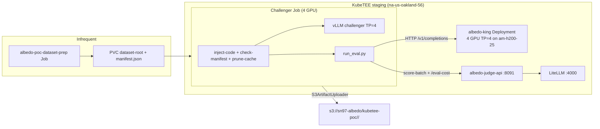

# KubeTEE SN90 — Denrite (Albedo) Evaluation PoC

## High-level shape

For the PoC, KubeTEE runs **one king-of-the-hill evaluation** as a plain
Kubernetes `Job` (no Armada — that's a follow-up) applied directly to the
`albedo-poc` namespace on `na-us-oakland-56-direct`.

**Split topology (current):**
- **Dataset corpus** — `deploy/dataset-prep.yaml` one-shot Job fills
  `albedo-poc-dataset-root` + verifies `manifest.json` against
  `albedo-poc-dataset-config`. Re-run only on corpus/version change or wiped PVC.
- **Always-on king** — `deploy/king.yaml` Deployment on `am-h200-25`
  (`kubetee.ai/albedo-king=true`), 4 GPU / TP=4, OpenAI-compatible HTTP
  behind ClusterIP `albedo-king:8000` (`king_serve.py` + local vLLM).
- **Challenger Job** — `deploy/eval.yaml`, 4 GPU / TP=4, mounts the prepared
  corpus, samples N IDs (`sample-ids.json` under `eval_run_id`), HTTP-generates
  against the king, local vLLM for the challenger, scores via shared judge,
  uploads artifacts.

King change protocol: set king state to `changing` → in-flight Jobs get
HTTP 503 `king_changing` → `fault_code=king_changed` (no registering verdict).

**Dataset pin (apple-to-apple scoring):** eval Jobs load the exact 100
`dataset.sample_ids` from
`kubetee/compare/reference-ca530856-ffa8-4e66-9175-7400e829e8c0/request.json`
via `ALBEDO_EVAL_SAMPLE_IDS_FILE` (same `manifest_hash`
`e3cff61772b0096811d4c5d8bbc8dee8dacbd9a069bc4557608adf1c1c2ddf40` as
`albedo-poc-dataset-config`). Seed resampling is disabled while that file
is set — the earlier seed-only PoC run (`7e09f071-…`, seed `kubetee-poc`)
had **0** overlap with this Denrite sample set.

Concurrent challengers need a **second non-CC H200** (king already owns
4 GPUs on `am-h200-25`).

No Denrite docker-compose, no Postgres-backed queue, no Bittensor chain
reads inside KubeTEE — the only dynamic inputs per job are the king and
challenger model refs + the eval/submission IDs.



## Why no Armada (PoC) — and what replaces it

Armada integration is **deferred** (follow-up #1 below). The PoC submits
the Job directly with `kubectl apply -f kubetee/deploy/eval.yaml`
from the KubeTEE side. The `eval.yaml` is a standalone `batch/v1`
`Job` (+ ConfigMap + PVCs; not embedded in an Armada `JobSubmitRequest`) — applied to the
`albedo-poc` namespace on `na-us-oakland-56-direct`. When Denrite
integration lands, they will edit the per-job env in a copy of this
manifest and `kubectl apply` it themselves (no SSH tunnel, no `armadactl`)
until the Armada path is built.

The existing `deploy/armada-job-template.yaml` is left in the tree as a
reference shape for the future Armada submit payload, but it is **not**
used in the PoC flow.

## Prerequisites (from Denrite, before the first job)

1. **King + challenger model refs** for the first run — public HF repo refs
   work (the PoC uses `hf://dendriteholdings/albedo-qwen3.6-35b-king-genesis`
   for the king and `hf://Qwen/Qwen3.6-35B-A3B` for the challenger as a
   smoke stand-in). The PoC bypasses Bittensor chain resolution, so we need
   explicit URIs.
2. **Hippius S3 bucket** — `sn97-albedo` on `https://s3.hippius.com`.
   Creds are in the out-of-band Secret.
3. **LiteLLM virtual key** for the judge (Secret key
   `ALBEDO_JUDGE_OPENROUTER_API_KEY`). Created on `llm.kubetee.ai` via
   `/key/generate`, with `metadata.priority: "prod"` so the
   `priority_reservation` pool gives the eval 60% of model capacity when
   the gateway is saturated.
4. **HF token** — in the Secret (key `HF_TOKEN`). Used for higher rate
   limits on the dataset + model pulls.
5. All secrets applied out-of-band per
   `fleet-gitops/infrastructure/SECRET-MANAGEMENT-STRATEGY.md` — never
   committed.

## Files in this directory

| File | Purpose |
|------|---------|
| `app/run_eval.py` | Per-job self-drive entrypoint. Builds an `EvalRequest` from env, wires `RemoteSettings` toward the shared `albedo-judge-api` Service, runs upstream `RemoteEvalWorker.execute()`, prints the verdict JSON to stdout. |
| `app/__init__.py` | Package marker so `PYTHONPATH=/app/shared/albedo/kubetee/app` works. |
| `Dockerfile` | NOT used in the live eval Job — the pod runs `vllm/vllm-openai:v0.23.0` and `inject-code` clones the albedo fork. Kept as a reference for a future custom eval image. |
| `Dockerfile.judge-api` | Slim Python image for the shared judge Deployment (`ghcr.io/kubetee-ai/albedo-judge-api`). |
| `deploy/eval.yaml` | Eval ConfigMap + `batch/v1 Job` + PVCs applied to `albedo-poc`. Two init containers + one `eval` container (no judge sidecar). |
| `deploy/judge-api.yaml` | Shared judge stack: ConfigMap (`ALBEDO_JUDGE_*`) + Deployment (`replicas: 1`) + Service `:8091` + NetworkPolicy (ingress from `albedo-poc` only). |
| `deploy/armada-job-template.yaml` | Reference shape for a future Armada `JobSubmitRequest` — **not used in the PoC**. |
| `deploy/secret-template.yaml` | Template for the out-of-band Secret (LiteLLM key, `ALBEDO_JUDGE_API_AUTH_TOKEN`, HF, S3). |
| `.env` | Local non-committed copy of the Secret values (gitignored). |
| `.env.example` | Upstream albedo env reference — not used by the PoC pod (the pod reads from the ConfigMap + Secret). |

## Per-job inputs (set in `eval.yaml` per run)

| Env var | Meaning |
|---------|---------|
| `KING_MODEL_URI` | URI of the previous king model (HF repo, S3 path, Hippius ref, or local path). |
| `KING_MODEL_HASH` | sha256 of the king model artifact. |
| `CHALLENGER_MODEL_URI` | URI of the challenger model being evaluated. |
| `CHALLENGER_MODEL_HASH` | sha256 of the challenger model artifact. |
| `EVAL_RUN_ID` | Stable UUID for this evaluation — used in the S3 artifact path and the verdict JSON. |
| `SUBMISSION_ID` | Stable UUID for the submission — same inclusion in the verdict and artifacts. |

Everything else has a KubeTEE-side default in the ConfigMap.

## Pod architecture

The Job runs **one pod** on `am-h200-25` (non-CC, `runtimeClassName: nvidia`,
8x H200). It uses **no custom Docker image for eval** — the base is
`vllm/vllm-openai:v0.23.0`, and an init container clones the `kubetee-poc`
branch of `KubeTEE-AI-Blueprints/albedo` into a shared emptyDir.

Scoring goes to the **shared** `albedo-judge-api` Deployment+Service in
`albedo-poc` (`SELFDRIVE_JUDGE_BASE_URL=http://albedo-judge-api.albedo-poc.svc.cluster.local:8091`).
Keep **`replicas: 1`** — `QuestionPrepStore` is in-memory. Cost is keyed by
`eval_run_id` (`GET /eval-cost/{eval_run_id}`) so concurrent Jobs stay isolated.
NetworkPolicy allows ingress TCP/8091 only from `albedo-poc`. Auth:
`ALBEDO_JUDGE_API_AUTH_TOKEN` (judge) must match `SELFDRIVE_SCORING_AUTH_TOKEN`
(eval); `/health` and `/ready` stay unauthenticated for kubelet probes.

### Init containers

1. **`inject-code`** — `git clone --depth 1 --branch kubetee-poc
   https://github.com/KubeTEE-AI-Blueprints/albedo.git` into `/app/shared/albedo`.
2. **`check-dataset-manifest`** — fail fast unless `/app/dataset/manifest.json`
   exists and its sha256 matches `ALBEDO_EVAL_DATASET_MANIFEST_HASH` from
   `albedo-poc-dataset-config` (filled by `deploy/dataset-prep.yaml`).
3. **`prune-model-cache`** — deletes unused HF dirs under `/cache/models`
   (eval/node-local hygiene; not corpus ownership).
4. **`wait-for-king`** — polls `albedo-king` `/ready` until HTTP 200.

Corpus download/build is **not** in the eval Job — run
`deploy/dataset-prep.yaml` once (or on version/hash bump).

### Main containers

1. **`eval`** (staging only) — base `vllm/vllm-openai` + `inject-code` clone +
   `pip install -e .`, then `python3 …/run_eval.py`. Drives
   `RemoteEvalWorker`: downloads challenger weights to the `model-cache` PVC,
   spins up local vLLM (TP=4), HTTP-generates against the always-on king,
   samples from the prepared corpus, calls the shared judge Service for
   scoring, uploads artifacts to S3, and exits.
   **Production** will use the final Albedo Docker image (baked code + deps)
   instead of clone/`pip install` at Job start.

### Volumes

| Volume | Type | Size | Purpose |
|-------|------|------|---------|
| `model-cache` | PVC (`longhorn-v2` RWX) | 256Gi | King + challenger safetensors (retained across runs) |
| `dataset-root` | PVC (`longhorn-v2` RWX) | 512Gi | Public HF datasets + `manifest.json` (owned by dataset-prep Job) |
| `artifacts` | PVC (`longhorn-v2` RWX) | 64Gi | Per-run spool files, uploaded to S3 |
| `shared` | emptyDir | — | Code injection mount |
| `dshm` | emptyDir (Memory) | 64Gi | vLLM/NCCL shared memory |

## Judge → LiteLLM routing

The shared judge Deployment calls the in-cluster LiteLLM gateway at
`http://litellm.litellm.svc.cluster.local:4000` (set via
`ALBEDO_JUDGE_OPENROUTER_BASE_URL` in `judge-api.yaml`). The gateway serves
the same OpenAI-compatible `/v1/chat/completions` endpoint that albedo's
`OpenRouterJudgeClient` expects — pure env override, no albedo code change
for routing.

### The three model pools (critical to understand)

Albedo has **three** separate model pools, and confusing them causes the
eval to fail silently:

| Pool | Source | PoC value | Role |
|------|--------|-----------|------|
| **`JUDGE_MODELS`** | hardcoded in `judge_core.py:21` (NOT env-overridable) | `z-ai/glm-5.2`, `qwen/qwen3.5-397b-a17b`, `deepseek/deepseek-v4-flash-0731` | The **scoring panel**: each sample is scored by ALL judges in this tuple, on both king and challenger sides. Any judge 500 here → `parse_ok=False` → that sample is `scored=False`. |
| **`ALBEDO_JUDGE_EVALUATOR_MODEL`** | ConfigMap | `z-ai/glm-5.2` | The single model that generates per-sample yes/no questions and judges answers against them. Also the simulator fallback. |
| **`ALBEDO_JUDGE_SOTA_MODELS`** | ConfigMap | `z-ai/glm-5.2` (aligned to albedo production) | The pool of models that generate the reference trajectory. One is picked per sample, deterministically by `sample_id`. |

**The `JUDGE_MODELS` tuple is the load-bearing one for scoring success.**
It is hardcoded and not env-overridable, so all three models in it MUST be
served by the LiteLLM gateway. If any is down, the eval fails with
`PROVIDER_FAULT` (learned the hard way: qwen3.5 deployment was missing,
all 3 samples came back `scored=False`, verdict = `failed`).

### LiteLLM gateway configuration (per-model)

Each backend model in `JUDGE_MODELS` is configured in the LiteLLM DB with:

- **`additional_drop_params: ["provider", "usage", "reasoning"]`** (optional
  hygiene) — albedo's `OpenRouterJudgeClient` still sends OpenRouter-style
  `reasoning` / `provider` / `usage` for OpenRouter compatibility. LiteLLM
  can drop those before the SGLang backend; they do not disable thinking.
- **Thinking off for judge calls**: client sends `reasoning_effort: "none"`
  (plus OpenRouter `reasoning: {enabled: false}`). LiteLLM must keep
  `allowed_openai_params: ["reasoning_effort"]` on `z-ai/glm-5.2` so the
  param reaches SGLang. Do **not** set a global LiteLLM
  `extra_body.enable_thinking=false` on the shared model — other gateway
  clients still want default reasoning.

Set via `PATCH /model/{model_id}/update` from inside a LiteLLM pod (the
pods don't have curl/jq, so use Python's `urllib.request`).

### Cost tracking

LiteLLM exposes the per-request cost only in the `x-litellm-response-cost`
response header for non-streaming requests — it does NOT put `cost` in the
JSON `usage` body (which is where albedo's `judge_openrouter.py` reads it).
The `kubetee-poc` branch carries a diagnostic-only patch to
`judge_openrouter.py` that reads `x-litellm-response-cost` first, falling
back to `usage.cost` (so the same code works against real OpenRouter too).

Costs are accumulated **per `eval_run_id`** in the shared judge process
(`CostStore`). Eval Jobs fetch `GET /eval-cost/{eval_run_id}` (Bearer auth)
after the verdict and write `judge_cost` into `eval-summary.json`. Bare
`GET /eval-cost` returns 400 — there is no process-wide aggregate (that
would mix concurrent Jobs).

## Run the PoC

0. **Build + push the shared judge image** (from albedo repo root):
   ```bash
   docker buildx build --platform linux/amd64 \
     -f kubetee/Dockerfile.judge-api \
     -t ghcr.io/kubetee-ai/albedo-judge-api:latest --push .
   ```

1. **Apply the Secret** (out-of-band, never committed) — must include
   `ALBEDO_JUDGE_API_AUTH_TOKEN` matching `SELFDRIVE_SCORING_AUTH_TOKEN`,
   plus `HF_TOKEN` for dataset prep and gated weights:
   ```bash
   cp albedo/kubetee/deploy/secret-template.yaml \
     ~/kubetee-secret-backends/albedo-poc-secrets.yaml
   $EDITOR ~/kubetee-secret-backends/albedo-poc-secrets.yaml
   kubectl --context na-us-oakland-56-direct apply -f \
     ~/kubetee-secret-backends/albedo-poc-secrets.yaml
   ```

2. **Prepare the corpus once** (or on `ALBEDO_EVAL_DATASET_MANIFEST_HASH`
   / version change, or after a wiped PVC) — **not** on every new king and
   **not** on every eval Job:
   ```bash
   kubectl --context na-us-oakland-56-direct apply -f \
     albedo/kubetee/deploy/dataset-prep.yaml
   kubectl --context na-us-oakland-56-direct -n albedo-poc \
     wait --for=condition=complete job/albedo-poc-dataset-prep --timeout=6h
   ```

3. **Apply judge + king** (king must own its 4 GPUs before any eval Job):
   ```bash
   kubectl --context na-us-oakland-56-direct label node am-h200-25 \
     kubetee.ai/albedo-king=true --overwrite
   kubectl --context na-us-oakland-56-direct apply -f \
     albedo/kubetee/deploy/judge-api.yaml \
     albedo/kubetee/deploy/king.yaml
   kubectl --context na-us-oakland-56-direct -n albedo-poc \
     rollout status deploy/albedo-king --timeout=45m
   ```
   Confirm the judge pod stays `Ready` after the NetworkPolicy apply
   (kubelet probes are host-sourced; if Ready flips False, add a narrow
   Calico host allow).

4. **Verify judge backends** served by the gateway (a missing backend is
   the #1 cause of `PROVIDER_FAULT` verdicts):
   ```bash
   kubectl --context na-us-oakland-56-direct -n nemo get pods -l app=qwen35-397b-a17b-fp8-sglang
   kubectl --context na-us-oakland-56-direct -n nemo get endpoints qwen35-397b-a17b-fp8-sglang
   # Repeat for glm-5-2-nvfp4-sglang + the dsv4-0731 services.
   ```

5. **Start the eval** (restart — delete the old Job first if it exists):
   ```bash
   kubectl --context na-us-oakland-56-direct -n albedo-poc delete job \
     albedo-poc-eval --ignore-not-found=true
   kubectl --context na-us-oakland-56-direct apply -f \
     albedo/kubetee/deploy/eval.yaml
   ```

6. **Watch the pod**:
   ```bash
   kubectl --context na-us-oakland-56-direct -n albedo-poc get pods -l \
     app.kubernetes.io/name=albedo-poc -o wide
   kubectl --context na-us-oakland-56-direct -n albedo-poc logs -f \
     <pod-name> -c eval
   kubectl --context na-us-oakland-56-direct -n albedo-poc logs -f \
     deploy/albedo-judge-api
   ```
   Expected log sequence:
   - `inject-code`: "code injection complete"
   - `check-dataset-manifest`: "dataset manifest hash OK"
   - `prune-model-cache`: prune summary (or "no /cache/models/hf")
   - `wait-for-king`: "king ready"
   - `eval`: challenger vLLM + remote king HTTP, judge traffic to LiteLLM,
     final verdict JSON with `score_king`, `score_challenger`,
     `challenger_won`, `S3ArtifactUploader` upload confirmations
   - `judge-api`: `[judge-openrouter] usage purpose=... cost=0.0xxxxx`
     (non-zero cost after the cost-header patch), `score_batch_done`

7. **Verify artifacts landed in S3**:
   ```bash
   # From a pod with Hippius creds, or via the albedo pod itself:
   kubectl --context na-us-oakland-56-direct -n albedo-poc exec \
     <pod-name> -c eval -- python3 -c 'import boto3, os; s=boto3.client("s3",
     endpoint_url="https://s3.hippius.com",
     aws_access_key_id=os.environ["AWS_ACCESS_KEY_ID"],
     aws_secret_access_key=os.environ["AWS_SECRET_ACCESS_KEY"]);
     print([o.key for o in s.list_objects_v2(Bucket="sn97-albedo",
     Prefix="kubetee-poc/<eval_run_id>/").get("Contents",[])])'
   ```

## Safety notes

- **Never force-delete** the eval pod: `kubectl delete pod --force` is
  forbidden on any pod that may hold TDX/vfio state. Use `kubectl delete
  pod` (graceful) or `kubectl delete job` and wait. The PoC runs with
  `runtimeClassName: nvidia` so no CC risk, but the advice holds for the
  later confidential iteration.
- **No Fleet reconciliation** on the PoC artifacts — the ConfigMap +
  Secret are applied ad hoc on `na-us-oakland-56`. Fleet does not revert
  objects outside its bundles.
- **kubectl context** — all PoC ops from local use `na-us-oakland-56-direct`.
  Fleet ops (if ever needed) use `stagingrancher`. Never mix.

## Latest apple-to-apple PoC eval (2026-08-10) — post `origin/main` merge

Pinned to Denrite reference `ca530856-ffa8-4e66-9175-7400e829e8c0` via
`ALBEDO_EVAL_SAMPLE_IDS_FILE` (same 100 `sample_ids`, `manifest_hash=e3cff617…`,
same king/challenger HF revision hashes). Split topology on `na-us-oakland-56`
(always-on king + challenger Job TP=4 on `am-h200-25`; judge via
`albedo-judge-api:main-merge-20260810221000` → LiteLLM → `z-ai/glm-5.2` + simulate
`deepseek/deepseek-v4-flash-0731`).

**Merged from Denrite `main` before this run:** fence-aware `<think>` strip,
phase read caps (`cold`/`pre_edit`/`at_edit`), discarded-questions audit.
KubeTEE adaptive concurrency kept; Engy routing opt-in only (unset on PoC).

| Field | Value |
|-------|--------|
| `eval_run_id` | `fd245d96-ad6e-46dd-b101-a92a88b6ec05` |
| `submission_id` | `30a82d0a-14ac-408b-8913-ab82d60e02f8` |
| Verdict | `succeeded` (`challenger_won=false`) |
| Scores | challenger **0.650496** / king **0.68124** (margin **−3.07 pp**) |
| Samples | **100/100** scored (`king_vllm_errors=0`, `chal_vllm_errors=0`) |
| King | `hf://tojointhecommunity/albedo-qwen3.6-35b-top@438aec1140de06268cc36b79dc9567129678888c` |
| Challenger | `hf://bkn1890/albedo-qwen3.6-35b-hk971@1ba87c52697f154a8f75a33ddf5714c1d314bcc7` |
| Wall clock | **2344 s** (~39.1 min) — `worker.execute` only |
| Judge spend | **$6.87** (3953 requests; glm-5.2 $5.75 + dsv4-flash $1.12) |
| GPU spend (challenger Job) | **$6.51** (4× H200 @ $2.50/gpu/h × 0.651 h) |
| Total (judge + GPU) | **$13.38** |

### vs Denrite origin `ca530856` (challenger won on dashboard)

| | Origin (Denrite) | KubeTEE `fd245d96` (post-main) | KubeTEE `9a0f5f09` (pre-main) |
|--|------------------|-------------------------------|-------------------------------|
| Hardware | 8× RTX PRO 6000 Blackwell | H200 | H200 |
| Challenger | **0.689451** | **0.650496** (−3.90 pp) | **0.68715** (−0.23 pp) |
| King | **0.659136** | **0.68124** (+2.21 pp) | **0.665788** (+0.67 pp) |
| Margin | **+3.03 pp** (won) | **−3.07 pp** (no win) | **+2.14 pp** (no win; need +3.00) |
| Scored | 100/100 | 100/100 | 100/100 |
| Winner agree (paired) | — | **57%** | **50%** |
| MAE chal / king | — | 0.172 / 0.169 | ~0.154 / 0.155 |
| Worker wall / total $ | — | 39.1 min / $13.38 | 31.5 min / $11.89 |

Stats: `kubetee/compare/kubetee-runs/compare-vs-origin.json`.

Public artifacts (Hippius): each **object** is `public-read` (HTTP 200).
Anonymous **prefix listing** is denied (`…/fd245d96…/` → 403 `AccessDenied`) —
open the file URLs below, not the directory URL.

| Artifact | URL |
|----------|-----|
| Verdict | https://s3.hippius.com/sn97-albedo/kubetee-poc/fd245d96-ad6e-46dd-b101-a92a88b6ec05/verdict.json |
| Eval summary (time + $) | https://s3.hippius.com/sn97-albedo/kubetee-poc/fd245d96-ad6e-46dd-b101-a92a88b6ec05/eval-summary.json |
| Request | https://s3.hippius.com/sn97-albedo/kubetee-poc/fd245d96-ad6e-46dd-b101-a92a88b6ec05/request.json |
| Progress | https://s3.hippius.com/sn97-albedo/kubetee-poc/fd245d96-ad6e-46dd-b101-a92a88b6ec05/progress.jsonl |
| Generated samples | https://s3.hippius.com/sn97-albedo/kubetee-poc/fd245d96-ad6e-46dd-b101-a92a88b6ec05/generated-samples.jsonl |
| Scoring results | https://s3.hippius.com/sn97-albedo/kubetee-poc/fd245d96-ad6e-46dd-b101-a92a88b6ec05/scoring-results.jsonl |
| Remote logs | https://s3.hippius.com/sn97-albedo/kubetee-poc/fd245d96-ad6e-46dd-b101-a92a88b6ec05/remote-logs.txt |

Reference Denrite eval (pin source + origin scores):
`kubetee/compare/reference-ca530856-ffa8-4e66-9175-7400e829e8c0/`
([detail](https://pub-e2a73e9642e74a2ea78d2910c7a86025.r2.dev/detail.html?eval_run_id=ca530856-ffa8-4e66-9175-7400e829e8c0)).

### Earlier seed-only PoC (2026-08-09, not apple-to-apple)

`7e09f071-4514-4ae0-9b92-6cf02019544f` — seed-resampled 100 IDs (**0** overlap
with ca530856). Scores chal 0.6359 / king 0.6364. Kept for cost/wall-clock
history only (~$13.39 judge+GPU, ~39 min).

### Observed idle-GPU window

After multi-turn generation, `RemoteEvalWorker` closes the local challenger
vLLM (`VllmProcessGenerator.close()` → EngineCore SIGTERM) and then runs
HTTP scoring + S3 upload **in the same Job**, which still holds
`nvidia.com/gpu: 4`. Scoring itself needs no eval-pod GPUs (judge-api /
LiteLLM only). See follow-up #6.

## Offer from KubeTEE SN90 — public inference on the reigning king

**KubeTEE SN90 offers to serve the Albedo / Distil (SN97) king-of-the-hill
model for public inference**, in addition to running the GPU eval stack in
this PoC.

Why this is a natural fit:

- The PoC already keeps an **always-on king** (`deploy/king.yaml`) with an
  OpenAI-compatible surface (`king_serve.py` → local vLLM `/v1/*` on
  `albedo-king:8000`).
- SN90’s LiteLLM gateway (`llm.kubetee.ai`) already fronts other cluster
  models (GLM-5.2, DeepSeek-V4-Flash, Kimi-K3, …). Registering the king is
  the same pattern: `openai/<public-model-name>` →
  `http://albedo-king.albedo-poc.svc.cluster.local:8000/v1`.
- Upstream Distil already exposes a public king chat at
  [chat.arbos.life](https://chat.arbos.life). SN90 can host a **second,
  capacity-backed** path on KubeTEE GPUs (and later on confidential
  `kata-*` runtimes) so the distilled champion is available to the public
  through SN90’s demand channels — including the **SN28 (SayGM)
  integration** (not exclusive; KubeTEE may also serve the public
  directly via LiteLLM / other partners).

Operational notes for Denrite / Albedo if the offer is accepted:

- King reloads use the existing `king_changing` → HTTP 503 protocol so
  in-flight evals and chat clients fail soft / retry instead of corrupting
  a duel verdict.
- Chat load and challenger Jobs share the king node’s GPUs — capacity and
  RPM need an explicit agreement (or a dedicated king replica for public
  serve).
- Model identity should track the on-chain / dashboard reigning king
  (HF URI + revision), not a stale PoC pin, when productionized.

Tracked as follow-up **#7** below. Subnet-side write-up:
[KubeTEE-AI/kubetee-subnet `docs/SN97-ALBEDO-POC.md`](https://github.com/KubeTEE-AI/kubetee-subnet/blob/main/docs/SN97-ALBEDO-POC.md)
(Integration opportunities).

## Follow-ups after PoC success

1. **Armada integration** — replace the direct `kubectl apply` of the
   `Job` with an Armada `JobSubmitRequest` so Denrite's external
   eval-dispatcher can submit evaluations themselves via the Armada
   Submit API. `deploy/armada-job-template.yaml` is the reference shape.
   Requires: expose the Armada Submit API on `armada-api.kubetee.ai`
   (Traefik IngressRoute + TLS + whitelist) so Denrite can submit without
   an SSH tunnel.
2. **Long-lived king-model warm caching** — the `model-cache` PVC already
   retains the king across runs; pre-pull the king safetensors to the PV
   so per-job cost is dominated by the challenger download, not the king.
3. **Register the last hard-coded judge ID in LiteLLM** — `JUDGE_MODELS`
   currently includes `deepseek/deepseek-v4-flash-0731` (already served
   by two SGLang H200 deployments) and `qwen/qwen3.5-397b-a17b` (deployed
   on `am-h200-28` CC). No gaps remain once qwen3.5 is `Ready`. If albedo
   upstream changes `JUDGE_MODELS`, re-verify all entries are served.
4. **Confidential evaluation** — flip the pod's `runtimeClassName` to
   `kata-qemu-nvidia-gpu-tdx-runtime-rs` and swap `longhorn-v2` PVCs for
   `kata-direct` direct volumes, reusing the already-deployed
   `kata-deploy-shim-overlay` + `kata-deploy-gpu-extension-overlay` Fleet
   bundles. The qwen3.5 backend on `am-h200-28` already validates this
   CC path end-to-end.
5. **Integrate with Denrite's real dispatcher** — once the PoC flow is
   stable, Denrite points their real eval-dispatch loop at the same
   endpoint (Armada or direct `kubectl apply`) and retires manual
   submissions.
6. **Split generation vs scoring Jobs (free challenger GPUs sooner)** —
   Today `_execute()` is monolithic: after `close()` on the challenger
   vLLM, scoring + artifact upload still run in the GPU Job.
   **Improvement:** checkpoint durable gen outputs (and `request` /
   `category_prep_id`) as soon as trajectories finish → exit/scale down
   the 4-GPU Job → run a **CPU-only** score Job that reads the checkpoint,
   calls `albedo-judge-api`, and writes the verdict. Requires a
   score-from-artifacts entrypoint (not present today — `generated-samples`
   is only uploaded in `_write_and_upload_artifacts` after scoring) and
   wiring `category_prep_id` across Jobs. Multi-turn observation simulation
   during generation still needs the GPU Job; only the final score/upload
   window is reclaimable. Unlocks overlapping evals once a second
   challenger node (or freed GPUs on the king node) is available.
7. **Public king inference (SN90 offer)** — register the always-on king in
   LiteLLM and publish it for public use (SN90 capacity + SN28/SayGM
   integration — not exclusive). Track reigning-king HF URI/revision;
   separate or rate-limit public chat vs duel traffic; optional later
   move to confidential serve. See [Offer from KubeTEE SN90](#offer-from-kubetee-sn90--public-inference-on-the-reigning-king) above.
