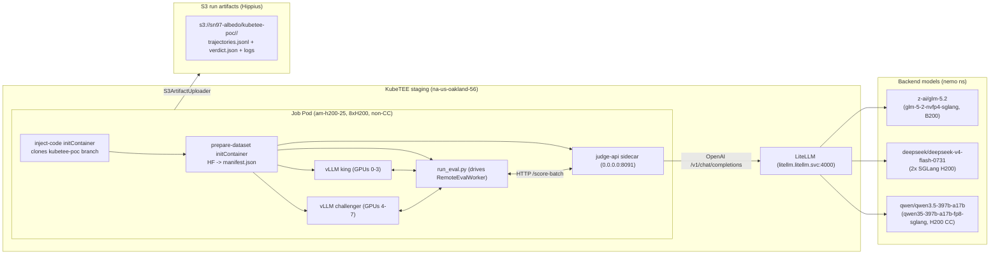

# SN97 Denrite (Albedo) — KubeTEE Evaluation PoC

## High-level shape

For the PoC, KubeTEE runs **one king-of-the-hill evaluation** as a plain
Kubernetes `Job` (no Armada — that's a follow-up) applied directly to the
`albedo-poc` namespace on `na-us-oakland-56-direct`. The Job lands on a
single non-CC 8-GPU H200 node (`am-h200-25`, `runtimeClassName: nvidia`),
runs albedo's `RemoteEvalWorker` which spins up two vLLM tensor-parallel
instances (previous king on GPUs 0-3, challenger on GPUs 4-7), samples the
public `mini-coder+open-swe+smith-rs+hero-v1` dataset, judges the outputs
through the in-cluster **LiteLLM gateway**
(`http://litellm.litellm.svc.cluster.local:4000`), uploads run artifacts
(trajectories + verdict JSON + logs) to **S3 on Hippius** (`sn97-albedo`
bucket) via albedo's native `S3ArtifactUploader`, and exits.

No Denrite docker-compose, no Postgres-backed queue, no Bittensor chain
reads inside KubeTEE — the only dynamic inputs per job are the king and
challenger model refs + the eval/submission IDs. Everything else (judge
URL, judge models, sample count, GPU split, image, cluster placement) is
baked into KubeTEE-side config.



## Why no Armada (PoC) — and what replaces it

Armada integration is **deferred** (follow-up #1 below). The PoC submits
the Job directly with `kubectl apply -f kubetee/deploy/pod-template.yaml`
from the KubeTEE side. The `pod-template.yaml` is a standalone `batch/v1`
`Job` (not embedded in an Armada `JobSubmitRequest`) — applied to the
`albedo-poc` namespace on `na-us-oakland-56-direct`. When Denrite
integration lands, they will edit the per-job env in a copy of this
manifest and `kubectl apply` it themselves (no SSH tunnel, no `armadactl`)
until the Armada path is built.

The existing `deploy/armada-job-template.yaml` is left in the tree as a
reference shape for the future Armada submit payload, but it is **not**
used in the PoC flow.

## Prerequisites (from Denrite, before the first job)

1. **King + challenger model refs** for the first run — public HF repo refs
   work (the PoC uses `hf://dendriteholdings/albedo-qwen3.6-35b-king-genesis`
   for the king and `hf://Qwen/Qwen3.6-35B-A3B` for the challenger as a
   smoke stand-in). The PoC bypasses Bittensor chain resolution, so we need
   explicit URIs.
2. **Hippius S3 bucket** — `sn97-albedo` on `https://s3.hippius.com`.
   Creds are in the out-of-band Secret.
3. **LiteLLM virtual key** for the judge (Secret key
   `ALBEDO_JUDGE_OPENROUTER_API_KEY`). Created on `llm.kubetee.ai` via
   `/key/generate`, with `metadata.priority: "prod"` so the
   `priority_reservation` pool gives the eval 60% of model capacity when
   the gateway is saturated.
4. **HF token** — in the Secret (key `HF_TOKEN`). Used for higher rate
   limits on the dataset + model pulls.
5. All secrets applied out-of-band per
   `fleet-gitops/infrastructure/SECRET-MANAGEMENT-STRATEGY.md` — never
   committed.

## Files in this directory

| File | Purpose |
|------|---------|
| `app/run_eval.py` | Per-job self-drive entrypoint. Builds an `EvalRequest` from env, wires `RemoteSettings` toward the in-pod judge-api sidecar, runs upstream `RemoteEvalWorker.execute()`, prints the verdict JSON to stdout. |
| `app/__init__.py` | Package marker so `PYTHONPATH=/app/shared/albedo/kubetee/app` works. |
| `Dockerfile` | NOT used in the live flow — the pod runs `vllm/vllm-openai:v0.23.0` directly and `inject-code` clones the albedo fork into a shared emptyDir. Kept as a reference for a future custom image build (e.g. when we want to drop the git clone init step). |
| `deploy/pod-template.yaml` | The `batch/v1 Job` + 3 PVCs (`dataset-root`, `artifacts`, `model-cache`) applied directly to `albedo-poc`. Two init containers (`inject-code`, `prepare-dataset`) + two main containers (`eval`, `judge-api` sidecar). |
| `deploy/armada-job-template.yaml` | Reference shape for a future Armada `JobSubmitRequest` — **not used in the PoC**. |
| `deploy/configmap-poc-env.yaml` | Non-secret env (judge URL, judge models, sample count, GPU split, S3 layout, LiteLLM gateway URL). Applied out-of-band on `na-us-oakland-56-direct`. |
| `deploy/secret-template.yaml` | Template for the out-of-band Secret (LiteLLM virtual key, HF token, Hippius S3 creds). |
| `.env` | Local non-committed copy of the Secret values (gitignored). |
| `.env.example` | Upstream albedo env reference — not used by the PoC pod (the pod reads from the ConfigMap + Secret). |

## Per-job inputs (set in `pod-template.yaml` per run)

| Env var | Meaning |
|---------|---------|
| `KING_MODEL_URI` | URI of the previous king model (HF repo, S3 path, Hippius ref, or local path). |
| `KING_MODEL_HASH` | sha256 of the king model artifact. |
| `CHALLENGER_MODEL_URI` | URI of the challenger model being evaluated. |
| `CHALLENGER_MODEL_HASH` | sha256 of the challenger model artifact. |
| `EVAL_RUN_ID` | Stable UUID for this evaluation — used in the S3 artifact path and the verdict JSON. |
| `SUBMISSION_ID` | Stable UUID for the submission — same inclusion in the verdict and artifacts. |

Everything else has a KubeTEE-side default in the ConfigMap.

## Pod architecture

The Job runs **one pod** on `am-h200-25` (non-CC, `runtimeClassName: nvidia`,
8x H200). It uses **no custom Docker image** — the base is
`vllm/vllm-openai:v0.23.0` for all containers, and an init container clones
the `kubetee-poc` branch of `KubeTEE-AI-Blueprints/albedo` into a shared
emptyDir so the eval + judge-api containers get the albedo code + deps on
top of the v0.23.0 vLLM base.

### Init containers

1. **`inject-code`** — `git clone --depth 1 --branch kubetee-poc
   https://github.com/KubeTEE-AI-Blueprints/albedo.git` into `/app/shared/albedo`.
   This is how the albedo fork (with the cost-header patch and any other
   PoC-specific changes) reaches the pod without a custom Docker build.
2. **`prepare-dataset`** — runs
   `python3 /app/shared/albedo/scripts/prepare_datasets.py --dataset-root /app/dataset`
   on first run (skipped if `manifest.json` already exists on the PVC —
   the `dataset-root` PVC is retained across runs).

### Main containers

1. **`eval`** — `pip install -e .` + deps, then
   `python3 /app/shared/albedo/kubetee/app/run_eval.py`. Drives
   `RemoteEvalWorker`: downloads king + challenger weights to the
   `model-cache` PVC, spins up two vLLM instances (TP=4 each, king on
   GPUs 0-3, challenger on GPUs 4-7), runs the dataset, calls
   `judge-api` on `127.0.0.1:8091` for scoring, uploads artifacts to S3,
   touches `/shared/eval-done` and exits with the eval exit code.
2. **`judge-api`** — `pip install -e .` + deps, then `albedo-judge-api &`.
   Sidecar that serves `/score-batch` to the eval container. Watches
   `/shared/eval-done` and shuts down when the eval finishes — this is the
   mechanism that lets the Job complete (otherwise the sidecar keeps the
   pod `Running` forever).

### Volumes

| Volume | Type | Size | Purpose |
|-------|------|------|---------|
| `model-cache` | PVC (`longhorn-v2` RWX) | 256Gi | King + challenger safetensors (retained across runs) |
| `dataset-root` | PVC (`longhorn-v2` RWX) | 512Gi | Public HF datasets + `manifest.json` (retained across runs) |
| `artifacts` | PVC (`longhorn-v2` RWX) | 64Gi | Per-run spool files, uploaded to S3 |
| `shared` | emptyDir | — | Code injection mount + `/shared/eval-done` marker |
| `dshm` | emptyDir (Memory) | 64Gi | vLLM/NCCL shared memory |

## Judge → LiteLLM routing

The judge-api sidecar calls the in-cluster LiteLLM gateway at
`http://litellm.litellm.svc.cluster.local:4000` (set via
`ALBEDO_JUDGE_OPENROUTER_BASE_URL` in the ConfigMap). The gateway serves
the same OpenAI-compatible `/v1/chat/completions` endpoint that albedo's
`OpenRouterJudgeClient` expects — pure env override, no albedo code change
for routing.

### The three model pools (critical to understand)

Albedo has **three** separate model pools, and confusing them causes the
eval to fail silently:

| Pool | Source | PoC value | Role |
|------|--------|-----------|------|
| **`JUDGE_MODELS`** | hardcoded in `judge_core.py:21` (NOT env-overridable) | `z-ai/glm-5.2`, `qwen/qwen3.5-397b-a17b`, `deepseek/deepseek-v4-flash-0731` | The **scoring panel**: each sample is scored by ALL judges in this tuple, on both king and challenger sides. Any judge 500 here → `parse_ok=False` → that sample is `scored=False`. |
| **`ALBEDO_JUDGE_EVALUATOR_MODEL`** | ConfigMap | `z-ai/glm-5.2` | The single model that generates per-sample yes/no questions and judges answers against them. Also the simulator fallback. |
| **`ALBEDO_JUDGE_SOTA_MODELS`** | ConfigMap | `z-ai/glm-5.2` (aligned to albedo production) | The pool of models that generate the reference trajectory. One is picked per sample, deterministically by `sample_id`. |

**The `JUDGE_MODELS` tuple is the load-bearing one for scoring success.**
It is hardcoded and not env-overridable, so all three models in it MUST be
served by the LiteLLM gateway. If any is down, the eval fails with
`PROVIDER_FAULT` (learned the hard way: qwen3.5 deployment was missing,
all 3 samples came back `scored=False`, verdict = `failed`).

### LiteLLM gateway configuration (per-model)

Each backend model in `JUDGE_MODELS` is configured in the LiteLLM DB with:

- **`additional_drop_params: ["provider", "usage", "reasoning"]`** — albedo's
  `OpenRouterJudgeClient` always sends OpenRouter-style `reasoning`,
  `provider`, `usage` fields in the payload (for OpenRouter compatibility —
  lets us switch `base_url` with no code change). LiteLLM drops these before
  forwarding to the SGLang backend.
- **For `z-ai/glm-5.2` only**: `extra_body: {chat_template_kwargs:
  {enable_thinking: false}}` — disables GLM-5.2's thinking output (it
  reasons by default, which produced 20K reasoning tokens per request and
  caused `/score-batch` `ReadTimeout`). This is the SGLang-native way to
  disable thinking, injected by LiteLLM so the albedo client doesn't need
  to know about it.

Set via `PATCH /model/{model_id}/update` from inside a LiteLLM pod (the
pods don't have curl/jq, so use Python's `urllib.request`).

### Cost tracking

LiteLLM exposes the per-request cost only in the `x-litellm-response-cost`
response header for non-streaming requests — it does NOT put `cost` in the
JSON `usage` body (which is where albedo's `judge_openrouter.py` reads it).
The `kubetee-poc` branch carries a diagnostic-only patch to
`judge_openrouter.py` that reads `x-litellm-response-cost` first, falling
back to `usage.cost` (so the same code works against real OpenRouter too).
Without this patch the `cost=0.00000000` in the judge-api logs is
misleading — the gateway IS charging the virtual key, just not in the
field albedo reads.

## Run the PoC

1. **Apply the ConfigMap** (out-of-band, not Fleet-managed):
   ```bash
   kubectl --context na-us-oakland-56-direct apply -f \
     albedo/kubetee/deploy/configmap-poc-env.yaml
   ```

2. **Apply the Secret** (out-of-band, never committed):
   ```bash
   # Fill in the template locally (outside the repo):
   cp albedo/kubetee/deploy/secret-template.yaml \
     ~/kubetee-secret-backends/albedo-poc-secrets.yaml
   $EDITOR ~/kubetee-secret-backends/albedo-poc-secrets.yaml
   kubectl --context na-us-oakland-56-direct apply -f \
     ~/kubetee-secret-backends/albedo-poc-secrets.yaml
   ```

3. **Verify all 3 judge models are served** by the gateway (a missing
   backend here is the #1 cause of `PROVIDER_FAULT` verdicts):
   ```bash
   kubectl --context na-us-oakland-56-direct -n nemo get pods -l app=qwen35-397b-a17b-fp8-sglang
   kubectl --context na-us-oakland-56-direct -n nemo get endpoints qwen35-397b-a17b-fp8-sglang
   # Repeat for glm-5-2-nvfp4-sglang + the dsv4-0731 services.
   # All 3 must have an endpoint IP before starting the eval.
   ```

4. **Start the eval** (restart — delete the old Job first if it exists):
   ```bash
   kubectl --context na-us-oakland-56-direct -n albedo-poc delete job \
     albedo-poc-eval --ignore-not-found=true
   kubectl --context na-us-oakland-56-direct -n albedo-poc apply -f \
     albedo/kubetee/deploy/pod-template.yaml
   ```

5. **Watch the pod**:
   ```bash
   kubectl --context na-us-oakland-56-direct -n albedo-poc get pods -l \
     app.kubernetes.io/name=albedo-poc -o wide
   kubectl --context na-us-oakland-56-direct -n albedo-poc logs -f \
     <pod-name> -c eval
   kubectl --context na-us-oakland-56-direct -n albedo-poc logs -f \
     <pod-name> -c judge-api
   ```
   Expected log sequence:
   - `inject-code`: "code injection complete"
   - `prepare-dataset`: "manifest.json exists" (or dataset download on first run)
   - `eval`: vLLM loads king + challenger, `Uvicorn running`, judge traffic
     to LiteLLM, final verdict JSON with `score_king`, `score_challenger`,
     `challenger_won`, `S3ArtifactUploader` upload confirmations
   - `judge-api`: `[judge-openrouter] usage purpose=... cost=0.0xxxxx`
     (non-zero cost after the cost-header patch), `score_batch_done
     scored=3/3`

6. **Verify artifacts landed in S3**:
   ```bash
   # From a pod with Hippius creds, or via the albedo pod itself:
   kubectl --context na-us-oakland-56-direct -n albedo-poc exec \
     <pod-name> -c eval -- python3 -c 'import boto3, os; s=boto3.client("s3",
     endpoint_url="https://s3.hippius.com",
     aws_access_key_id=os.environ["AWS_ACCESS_KEY_ID"],
     aws_secret_access_key=os.environ["AWS_SECRET_ACCESS_KEY"]);
     print([o.key for o in s.list_objects_v2(Bucket="sn97-albedo",
     Prefix="kubetee-poc/<eval_run_id>/").get("Contents",[])])'
   ```

## Safety notes

- **Never force-delete** the eval pod: `kubectl delete pod --force` is
  forbidden on any pod that may hold TDX/vfio state. Use `kubectl delete
  pod` (graceful) or `kubectl delete job` and wait. The PoC runs with
  `runtimeClassName: nvidia` so no CC risk, but the advice holds for the
  later confidential iteration.
- **No Fleet reconciliation** on the PoC artifacts — the ConfigMap +
  Secret are applied ad hoc on `na-us-oakland-56`. Fleet does not revert
  objects outside its bundles.
- **kubectl context** — all PoC ops from local use `na-us-oakland-56-direct`.
  Fleet ops (if ever needed) use `stagingrancher`. Never mix.

## Follow-ups after PoC success

1. **Armada integration** — replace the direct `kubectl apply` of the
   `Job` with an Armada `JobSubmitRequest` so Denrite's external
   eval-dispatcher can submit evaluations themselves via the Armada
   Submit API. `deploy/armada-job-template.yaml` is the reference shape.
   Requires: expose the Armada Submit API on `armada-api.kubetee.ai`
   (Traefik IngressRoute + TLS + whitelist) so Denrite can submit without
   an SSH tunnel.
2. **Long-lived king-model warm caching** — the `model-cache` PVC already
   retains the king across runs; pre-pull the king safetensors to the PV
   so per-job cost is dominated by the challenger download, not the king.
3. **Register the last hard-coded judge ID in LiteLLM** — `JUDGE_MODELS`
   currently includes `deepseek/deepseek-v4-flash-0731` (already served
   by two SGLang H200 deployments) and `qwen/qwen3.5-397b-a17b` (deployed
   on `am-h200-28` CC). No gaps remain once qwen3.5 is `Ready`. If albedo
   upstream changes `JUDGE_MODELS`, re-verify all entries are served.
4. **Confidential evaluation** — flip the pod's `runtimeClassName` to
   `kata-qemu-nvidia-gpu-tdx-runtime-rs` and swap `longhorn-v2` PVCs for
   `kata-direct` direct volumes, reusing the already-deployed
   `kata-deploy-shim-overlay` + `kata-deploy-gpu-extension-overlay` Fleet
   bundles. The qwen3.5 backend on `am-h200-28` already validates this
   CC path end-to-end.
5. **Integrate with Denrite's real dispatcher** — once the PoC flow is
   stable, Denrite points their real eval-dispatch loop at the same
   endpoint (Armada or direct `kubectl apply`) and retires manual
   submissions.
